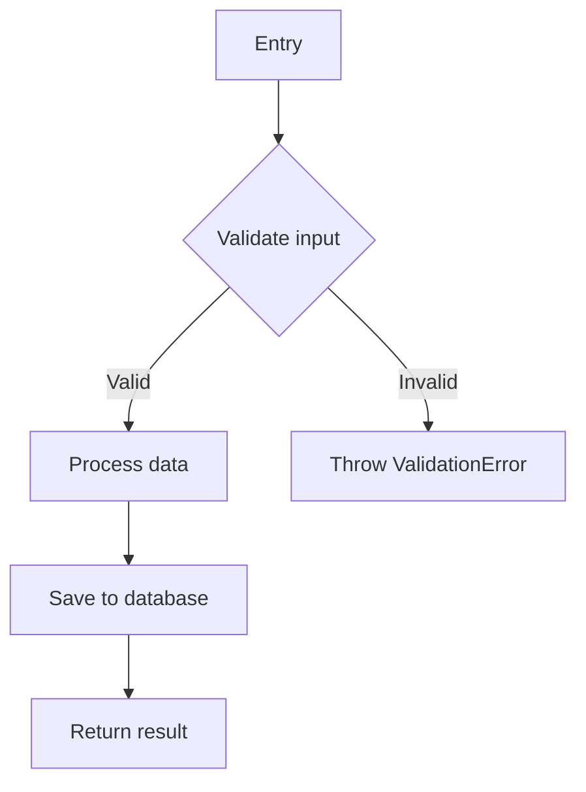
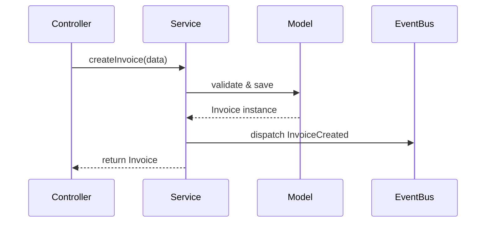
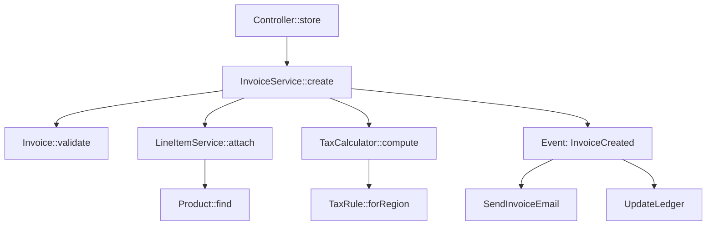

# Code Documenter

Generate thorough, engineer-ready `.md` documentation for code symbols (function, method, class) or business processes by investigating the codebase. All output files are **Obsidian-optimized Markdown** — formatted using the `obsidian-notes` skill so they render correctly and leverage Obsidian's features when opened in an Obsidian vault.

## Dependency: obsidian-notes Skill

This skill delegates all Markdown formatting decisions to the **`obsidian-notes` skill**. Before writing any `.md` file, load the `obsidian-notes` SKILL.md and follow its formatting rules. Specifically:

- **Wikilinks** — Use `[[Note Name]]` for all internal cross-references between documentation files (not standard Markdown links).
- **Callouts** — Use Obsidian callout syntax (`> [!type]`) instead of plain blockquotes for structured information (warnings, tips, important notes, examples). Refer to the obsidian-notes callout reference for available types.
- **Properties (YAML frontmatter)** — Add frontmatter metadata to every generated `.md` file: at minimum `tags` for categorization and any relevant custom properties (e.g., `type: symbol | process`, `entrypoint`, `status`).
- **Highlights** — Use `==highlighted text==` for key terms or critical information on first mention.
- **Comments** — Use `%%hidden comments%%` for editor-only annotations (e.g., investigation notes, TODOs for future updates).
- **Mermaid diagrams** — Always generate via a **subagent** that calls the MCP tool (`mcp_mcp-mermaid_generate_mermaid_diagram`), then wrap the returned code in a ` ```mermaid ` fenced code block as specified by obsidian-notes.
- **Math** — Use `$...$` for inline math and `$$...$$` for block math when documenting algorithms or formulas.
- **Tags** — Use frontmatter `tags` property for categorization (e.g., `tags: [documentation, process, invoice]`).

All other Obsidian formatting conventions from the obsidian-notes skill apply. When in doubt, consult the obsidian-notes references.

## Core Principles

### Documentation Language

Always write the documentation in the **same language expressed in the code**. Detect the language from variable names, comments, class names, and string literals. If the code uses Spanish identifiers and comments, write the documentation in Spanish. If English, write in English. Match the language the developers chose.

### Audience

The documentation must be **clear enough for a software engineer who knows nothing about the process being documented**. Avoid assuming prior context. Define every domain concept, explain every business rule, and describe the "why" behind decisions — not just the "what". Use the Glossary file to centralize key term definitions.

### File Structure

Never generate a single monolithic documentation file. Instead, create a **folder with an index and separate section files**:

```
docs/{documentation-name}/
├── index.md              ← Overview + links to all sections
├── sequence-diagram.md   ← Sequence / flow diagrams
├── step-breakdown.md     ← Step-by-step walkthrough
├── models-database.md    ← Models, tables, relationships
├── error-handling.md     ← Error paths and edge cases
├── glossary.md           ← Key terms and concepts
└── ...                   ← Additional section files as needed
```

Every `.md` file must include **YAML frontmatter** (properties) following Obsidian conventions:

```yaml
---
tags:
  - documentation
  - process          # or symbol, class, method, etc.
type: process         # or symbol
generated: 2024-01-15
---
```

In `index.md`, reference each section file using **wiki-link syntax** (Obsidian wikilinks):

```markdown
## Sections

- [[sequence-diagram]]
- [[step-breakdown]]
- [[models-database]]
- [[error-handling]]
- [[glossary]]
```

The `[[filename]]` link corresponds to `filename.md` in the same folder. Use spaces in the link when the filename has spaces: `[[Modulos CRM]]` → `Modulos CRM.md`.

### Glossary (Mandatory)

Every documentation output **must** include a `glossary.md` file containing definitions of all key domain terms, abbreviations, business concepts, models, and technical terms used throughout the documentation. Each entry should include:
- **Term name**
- **Definition** in plain language
- **Context** — where/how it appears in the codebase

### Mermaid Diagrams via Subagent

Delegate every diagram generation to a subagent. The subagent calls the **Mermaid MCP tool** (`mcp_mcp-mermaid_generate_mermaid_diagram`) to generate and validate the diagram, then returns the raw Mermaid code. The main agent embeds that code as a **text** fenced code block inside the corresponding `.md` file — never as images or external files.

```
runSubagent(
  description: "Generate {diagram type} for {subject}",
  prompt: "Generate a Mermaid {flowchart TD | sequenceDiagram | classDiagram | erDiagram} diagram for {subject}.
  Use this data as input: {paste the structured execution map / flow data / schema}.

  Steps:
  1. Draft the Mermaid source code based on the provided data.
  2. Try to call `mcp_mcp-mermaid_generate_mermaid_diagram` to validate it.
     - If the tool is available and validation passes: use the validated code.
     - If the tool is unavailable (not installed / server not running) or returns an error:
       skip validation and proceed with the manually drafted code. Ensure the syntax
       is correct by carefully following the official Mermaid syntax rules for the
       chosen diagram type.
  3. If MCP validation was used and failed, fix the syntax and retry once.

  Return ONLY the final Mermaid source code as a fenced
  code block (```mermaid ... ```). No prose, no explanation."
)
```

**One subagent per diagram.** When a documentation output requires multiple diagrams (e.g., a sequence diagram and a dependency flowchart), launch those subagent calls **in parallel** since they are independent.

## Subagent Strategy

This skill uses `runSubagent` to delegate investigation-heavy subtasks, keeping the main agent's context window lean and focused on documentation assembly.

### When to Use Subagents

| Scenario | Subagent Use | Rationale |
|----------|-------------|----------|
| **Process Documentation** → per-symbol investigation | **Always** | Each symbol in the process chain is investigated by a subagent. The main agent stays focused on the high-level flow and final documentation assembly. |
| **Process Documentation** → initial path mapping | **Always** | Use the `Explore` subagent to map the full execution path before writing anything. |
| **Symbol Documentation** → dependency & caller tracing | **When the symbol is complex** (calls 3+ dependencies, or has 5+ callers) | Delegates file-heavy tracing to a subagent, returns a structured summary. |
| **Symbol Documentation** → test analysis | **When test files are extensive** | Subagent reads tests and returns behavior summaries. |
| **Mermaid diagram generation** | **Always** | Every diagram (flowchart, sequence, ER, class) is generated by a dedicated subagent that calls the MCP tool, validates the syntax, and returns the final code block. Keeps the main agent context clean and allows parallel diagram generation. |

### Subagent Prompt Rules

Every subagent prompt **must**:

1. **Be fully self-contained** — include the symbol name, file path, line numbers, and any context the subagent needs. It has zero conversation history.
2. **Specify the exact output format** — tell the subagent what structured data to return (see templates below).
3. **Scope the task narrowly** — one symbol per subagent call. Never ask a subagent to "document the whole process".

---

## Workflow Decision Tree

Determine the documentation scope:

1. **Function/Method/Class** → Follow "Symbol Documentation" below
2. **Process** (high-level business workflow) → Follow "Process Documentation" below

---

## Symbol Documentation (Function / Method / Class)

Use this workflow when the user asks to document a specific function, method, or class.

### Investigation Steps

1. **Locate the symbol** — Use `list_code_usages`, `grep_search`, or `semantic_search` to find the definition.
2. **Read the full implementation** — Read the source file covering the entire symbol definition.
3. **Trace dependencies** — Identify all imports, called functions, used models/types, and injected services.
   - **Simple symbol** (≤3 dependencies): Read each dependency inline.
   - **Complex symbol** (>3 dependencies): Delegate to a subagent:
     ```
     runSubagent(
       description: "Trace {SymbolName} dependencies",
       prompt: "Investigate the dependencies of `{SymbolName}` defined in {file_path} at lines {start}-{end}.
       The symbol imports/calls: {list of dependency names}.
       For each dependency:
       1. Find its definition (file path + line number)
       2. Read its implementation
       3. Summarize what it provides to the caller (1-2 sentences)
       4. Note its own key dependencies if relevant
       Return a markdown table with columns: Symbol, File (with line number), Purpose, Key Details."
     )
     ```
4. **Trace callers** — Use `list_code_usages` to find all call sites.
   - **Few callers** (≤5): Read representative callers inline.
   - **Many callers** (>5): Delegate to a subagent:
     ```
     runSubagent(
       description: "Trace {SymbolName} callers",
       prompt: "Find all call sites of `{SymbolName}` defined in {file_path}.
       For each caller:
       1. File path and line number
       2. The calling context (which function/method calls it)
       3. How it's called (what arguments are passed, what's done with the return value)
       Return a markdown table with: Caller, File, Line, Arguments Passed, Usage Pattern.
       Then summarize the 2-3 most common usage patterns."
     )
     ```
5. **Identify edge cases** — Look for error handling, validation, guard clauses, default values, and boundary conditions.
6. **Check tests** — Search for test files covering the symbol. If tests are extensive (>100 lines), delegate:
     ```
     runSubagent(
       description: "Analyze {SymbolName} tests",
       prompt: "Read the test files for `{SymbolName}`.
       Test files: {list of test file paths}.
       For each test:
       1. Test name and description
       2. What behavior it verifies
       3. Edge cases covered
       Return a structured list of test cases with: Test Name, Behavior Verified, Edge Case (if any)."
     )
     ```

### Output Structure

Generate documentation following the template in [references/symbol-template.md](references/symbol-template.md).

Create a folder `docs/{symbol-name}/` with:

| File | Content |
|------|---------|
| `index.md` | Purpose, signature, parameters, return value + wiki-links to sections |
| `internal-flow.md` | Mermaid flowchart + prose walkthrough |
| `dependencies.md` | Dependency table and usage examples |
| `error-handling.md` | Error conditions, exceptions, side effects |
| `glossary.md` | Key terms, types, domain concepts used by the symbol |

For simple symbols (pure functions, small utilities), a single file with all sections is acceptable. Use the multi-file structure for any symbol with significant complexity.

### Mermaid Diagrams for Symbols

Delegate diagram generation to a subagent (see the "Mermaid Diagrams via Subagent" subagent template above). Pass the internal logic steps as structured data. The subagent returns a validated fenced code block; embed it directly in `internal-flow.md`.

Use `flowchart TD` for internal logic flow:



Use `classDiagram` for class documentation showing properties, methods, and relationships.

---

## Process Documentation

Use this workflow when the user asks to document a high-level business process (e.g., "document the invoice creation process", "document how the payment flow works").

### Investigation Steps

#### Phase 1: Exploration (use `Explore` subagent)

Delegate initial codebase mapping to the `Explore` subagent to avoid loading many files into the main context:

```
runSubagent(
  agentName: "Explore",
  description: "Map {process name} execution path",
  prompt: "Thoroughly trace the execution path for the '{process name}' process.
  Starting hint: {any user-provided entrypoint or route}.
  Steps:
  1. Find the entrypoint (controller, command, route, job)
  2. From the entrypoint, follow every function/method call, service invocation, and model interaction
  3. List every file, class, and method involved in the chain, in execution order
  4. For each method, note: file path, line numbers, what it calls next, what models/tables it touches, what events it dispatches
  5. Identify all decision points (conditionals, branching logic)
  6. Identify error handling / rollback logic
  Thoroughness: thorough.
  Return a structured execution map in this format:
  - Entrypoint: {file}#{line} — {Class::method}
  - Execution chain (ordered list): Step N → {Class::method} at {file}#{line} — calls → {next methods} — DB: {tables} — Events: {events}
  - Decision points: {location} — {condition} — {branches}
  - Error paths: {location} — {exception} — {handling}"
)
```

The `Explore` subagent returns a **structured execution map**. The main agent uses this map for all subsequent work without re-reading the traced files.

#### Phase 2: Per-symbol deep dives (use subagents)

For every significant symbol identified in Phase 1, launch a subagent to investigate it:

```
runSubagent(
  description: "Document {ClassName::method}",
  prompt: "Investigate `{ClassName::method}` defined in {file_path} at lines {start}-{end}.
  This method is step {N} in the '{process name}' process.
  It is called by: {caller}. It calls: {callees}.

  Perform a full symbol investigation:
  1. Read the complete implementation
  2. Document all parameters, return value, and types
  3. Trace its dependencies — for each called function, find the definition and summarize what it does
  4. Identify error conditions, exceptions thrown, and guard clauses
  5. List all database operations (reads, writes, deletes) with table names
  6. List all events dispatched or jobs queued
  7. Note any side effects (file I/O, external API calls, cache operations)

  Return a structured report with sections:
  - Signature: {full function/method signature}
  - Purpose: {1-2 sentence description}
  - Parameters: {table: Name, Type, Required, Description}
  - Return Value: {type and description}
  - Internal Logic: {step-by-step walkthrough with key code excerpts}
  - Dependencies: {table: Symbol, File#Line, Purpose}
  - DB Operations: {table: Operation, Table, Condition}
  - Events/Jobs: {table: Name, Data, Trigger condition}
  - Errors: {table: Condition, Exception, Behavior}
  - Side Effects: {list}"
)
```

**Parallelization**: Launch subagents for independent symbols in parallel (symbols that don't depend on each other's investigation results). This dramatically speeds up documentation of large processes.

#### Phase 3: Assembly (main agent)

With the execution map from Phase 1 and per-symbol reports from Phase 2, the main agent:

1. **Assembles the documentation files** — Writes each `.md` section file using the structured data from subagents.
2. **Generates Mermaid diagrams** — Launches one subagent per diagram (sequence diagram, dependency flowchart, ER diagram, etc.) in **parallel**, passing the relevant slice of the execution map as input. Each subagent calls the Mermaid MCP tool, validates syntax, and returns the fenced code block.
3. **Writes the glossary** — Collects all domain terms from subagent reports.
4. **Cross-references** — Ensures file links, wiki-links, and code excerpts are accurate.
5. **Checks related tests** — Search for integration/feature tests covering the process (delegate to subagent if extensive).

### Output Structure

Generate documentation following the template in [references/process-template.md](references/process-template.md).

Create a folder `docs/{process-name}/` with:

| File | Content |
|------|---------|
| `index.md` | Overview, entrypoint, trigger + wiki-links to all section files |
| `sequence-diagram.md` | Mermaid sequence diagram + component map |
| `step-breakdown.md` | Step-by-step walkthrough with code excerpts |
| `data-flow.md` | Data transformations at each stage |
| `models-database.md` | Models, tables, columns, relationships (ER diagram) |
| `events-side-effects.md` | Dispatched events, queued jobs, notifications |
| `error-handling.md` | Failure scenarios, rollback behavior, edge cases |
| `dependency-graph.md` | Full call tree as Mermaid flowchart |
| `glossary.md` | Domain terms, business concepts, abbreviations |

For each significant symbol in the process chain, either document it inline in `step-breakdown.md` or create a dedicated file (e.g., `invoice-service.md`) linked from the index.

### Mermaid Diagrams for Processes

Delegate every diagram to a subagent (see the "Mermaid Diagrams via Subagent" template above). Pass the relevant slice of the execution map as input data. Launch all diagram subagents **in parallel** at the start of Phase 3 — they are independent. Embed each returned fenced code block into the corresponding section `.md` file.

**Sequence diagram** for cross-component interaction (goes in `sequence-diagram.md`):



**Flowchart** for the full process dependency graph (goes in `dependency-graph.md`):



---

## General Guidelines

- **Investigate thoroughly** — Read actual source code. Never guess behavior. Every statement in the documentation must be backed by code read during investigation.
- **Use subagents to protect context** — Delegate file-heavy investigation to subagents. The main agent should primarily assemble and write documentation, not read dozens of files directly.
- **Subagent prompts must be self-contained** — Include file paths, line numbers, symbol names, and the expected return format. The subagent has no conversation history.
- **Parallel subagent calls** — When investigating multiple independent symbols (e.g., in Process Documentation Phase 2), launch their subagent calls in parallel to reduce total time.
- **Use file links** — Reference source code files with relative Markdown links including line numbers: `[InvoiceService](app/Services/InvoiceService.php#L45-L80)`. For cross-references between documentation files, always use Obsidian **wikilinks**: `[[glossary]]`, `[[step-breakdown]]`.
- **Include line numbers** — When referencing specific logic, include the line range.
- **Real code snippets** — Include relevant code excerpts (not the entire file) to illustrate key logic. Use fenced code blocks with the appropriate language.
- **Mermaid diagrams are mandatory** — Every documentation output must include at least one Mermaid diagram. Always delegate generation to a **subagent** using the template in the "Mermaid Diagrams via Subagent" section. The subagent calls the MCP tool, validates the syntax, and returns the fenced code block. Wrap in ` ```mermaid ` fenced code blocks. Use `flowchart`, `sequenceDiagram`, `classDiagram`, or `erDiagram` as appropriate.
- **Output path** — Create a folder `docs/{documentation-name}/` in the project root (or user-specified path). Use kebab-case for folder and file names: `docs/invoice-creation/index.md`. Never create a single monolithic file.
- **Wiki-links** — Reference section files with `[[filename]]` syntax (without `.md` extension). Example: `[[glossary]]`, `[[step-breakdown]]`, `[[Modulos CRM]]`.
- **Glossary is mandatory** — Every documentation output must include a `glossary.md` file defining all domain terms, abbreviations, and key concepts.
- **Language** — Write documentation in the same language used in the codebase (variable names, comments, strings). If the code is in Spanish, document in Spanish. If in English, document in English.
- **Audience** — The documentation targets software engineers who may have **zero prior knowledge** of the process. Be precise, technical, and thorough. Explain business context, define domain terms, and describe the purpose behind each decision. Avoid vague phrases. Prefer concrete descriptions backed by the code.
- **Obsidian formatting** — Follow the `obsidian-notes` skill for all Markdown formatting. Use callouts (`> [!type]`) for warnings, tips, and important notes instead of plain blockquotes. Use `==highlights==` for key terms on first mention. Add YAML frontmatter properties to every generated file. Use `%%comments%%` for internal annotations.
