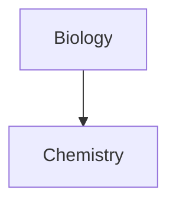

# Obsidian Markdown Syntax Reference

## Table of Contents

- [Text Formatting](#text-formatting)
- [Headings](#headings)
- [Lists](#lists)
- [Code](#code)
- [Tables](#tables)
- [Math](#math)
- [Blockquotes](#blockquotes)
- [Horizontal Rules](#horizontal-rules)
- [Footnotes](#footnotes)
- [Comments](#comments)
- [Diagrams](#diagrams)
- [Escaping](#escaping)

## Text Formatting

| Syntax | Result |
|---|---|
| `**bold**` or `__bold__` | **bold** |
| `*italic*` or `_italic_` | *italic* |
| `***bold and italic***` | ***bold and italic*** |
| `~~strikethrough~~` | ~~strikethrough~~ |
| `==highlight==` | ==highlight== |
| `**bold and _nested italic_**` | **bold and _nested italic_** |

Escape formatting with backslash: `\*\*not bold\*\*`

## Headings

```
# Heading 1
## Heading 2
### Heading 3
#### Heading 4
##### Heading 5
###### Heading 6
```

## Lists

### Unordered

Use `-`, `*`, or `+`:

```
- Item 1
- Item 2
  - Nested item
```

### Ordered

```
1. First
2. Second
   1. Nested ordered
```

### Task Lists

```
- [x] Completed task
- [ ] Incomplete task
  - [ ] Subtask
```

### Nesting

Mix list types freely. Indent with tab or 4 spaces:

```
1. Ordered item
   - Unordered nested
   - [ ] Task nested
```

## Code

### Inline

`` `inline code` ``

Use double backticks for code containing backticks: ``` ``code with `backtick` `` ```

### Code Blocks

````
```language
code here
```
````

Obsidian uses Prism for syntax highlighting. Specify language after opening backticks (e.g., `js`, `python`, `css`).

### Nesting Code Blocks

Use more backticks (or tildes) for the outer block than the inner:

`````
````md
```js
console.log("nested")
```
````
`````

## Tables

```
| Left | Center | Right |
|:-----|:------:|------:|
| L    |   C    |     R |
```

- Pipes `|` separate columns
- Colons in header separator control alignment: `:--` left, `:--:` center, `--:` right
- Content supports basic formatting, internal links, and embeds
- Escape pipes inside tables with `\|`

Wikilinks and image embeds in tables require escaping pipe:

```
| Column |
|--------|
| [[Note\|Display]] |
| ![[image.jpg\|200]] |
```

## Math

### Inline

```
This is inline math $e^{2i\pi} = 1$.
```

### Block

```
$$
\begin{vmatrix}a & b\\
c & d
\end{vmatrix}=ad-bc
$$
```

Uses MathJax with LaTeX notation.

## Blockquotes

```
> Blockquote text
> continues here
```

Nest with multiple `>`:

```
> Level 1
>> Level 2
```

## Horizontal Rules

Any of these on their own line:

```
---
***
___
```

## Footnotes

### Reference-style

```
Text with footnote[^1].

[^1]: Footnote content.
[^note]: Named footnotes appear as numbers.
[^multi]: Multi-line footnote.
  Indent continuation lines with 2 spaces.
```

### Inline

```
Text with inline footnote.^[This is inline.]
```

Note: Inline footnotes only render in Reading view, not Live Preview.

## Comments

```
This is an %%inline%% comment.

%%
Block comment.
Spans multiple lines.
Not visible in Reading view.
%%
```

## Diagrams

> **IMPORTANT**: Always use the MermaidJS MCP tool (`mcp_mcp-mermaid_generate_mermaid_diagram`) to generate Mermaid diagrams. Do NOT write Mermaid code manually.

Obsidian renders Mermaid diagrams inside fenced code blocks:

````

````

Supported: flowcharts, sequence diagrams, timelines, and all Mermaid diagram types.

### Linking Files in Diagrams

Add `internal-link` class to create clickable links to notes:

````

````

For special characters in note names, use double quotes: `class "⨳ special" internal-link`.

## Escaping

Escape special characters with `\`:

| Character | Escape |
|-----------|--------|
| `*` | `\*` |
| `_` | `\_` |
| `#` | `\#` |
| `` ` `` | `` \` `` |
| `\|` | `\|` |
| `~` | `\~` |

For numbered lists, escape the period: `1\. Not a list item`
